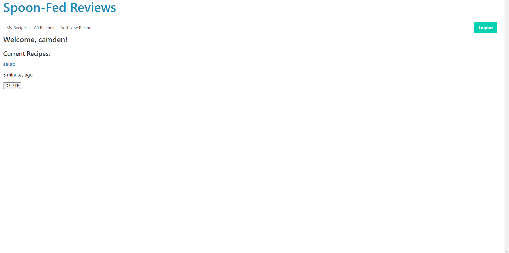
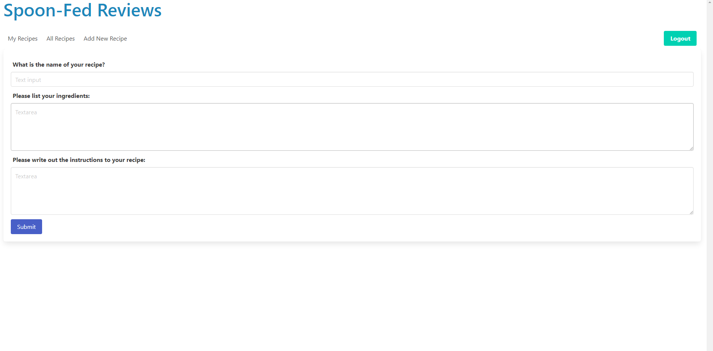

# Spoon-Fed Reviews

## Description

Link to Github Repo: https://github.com/camdenvs/spoon-fed-reviews
Link to deployed website: https://spoon-fed-reviews.herokuapp.com/

Our project is called "Spoon-Fed Reviews" which is a website dedicated to sharing and reviewing websites created by users. As a user, you are able to create a login and profile, where you can then write and upload recipes. Your recipes are stored in your profile and can be viewed by other users. Other users may comment on to "review" your recipe, as well as up-vote the recipe. The user has access to a compiled list of their recipes.

We decided to utilize a npm technology called date-fns to incorporate more appealing date and time stamps to our webpage.

Our team learned a lot, and got comfortable building the models, using sequelize, building our routes for the get, post, put and delete requests, and building a smooth UI.

## Table of Contents

- [Installation](#installation)
- [Usage](#usage)
- [Credits](#credits)
- [License](#license)

## Installation

1. We started by building our folder system in the standardized fashion.

2. We then created the necessary models, and routes, then seeded some data for testing.

3. We then set up our handlebars for all the different pages.

4. We used javascript, Bulma and CSS for styling and UI. We used date-fns for date and time stamps.

## Usage

1. Start by creating a login, you must enter an email and a password.

2. To view all recipes you have created, select "My recipes" to view them in a list.

3. To create a new recipe, select "Add new recipe" and follow the prompts to add the title, ingredients and instructions.

4. To view all recipes by all users, select "All recipes." You will be presented with a list of recipes on which you can view and leave a comment as a "review."

## Credits

- Collaborators: Bee, Margaret Delaney, Camden Van Sciver
- npm
- mysql
- sequelize
- nodejs
- express
- handlebars
- date-fns

## License

Distributed under the MIT License.
